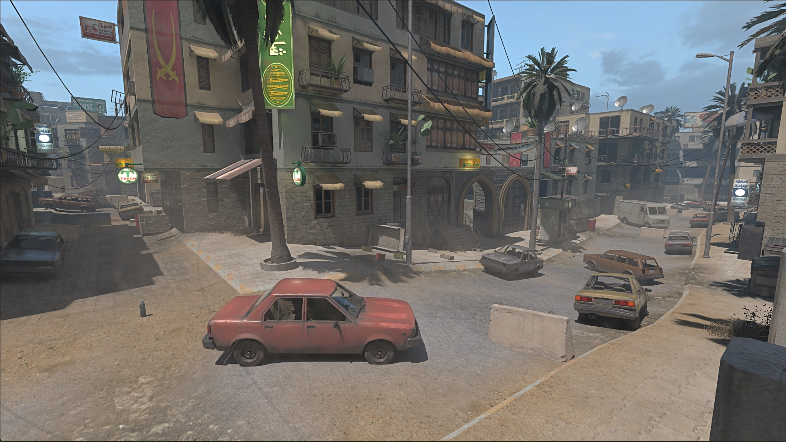
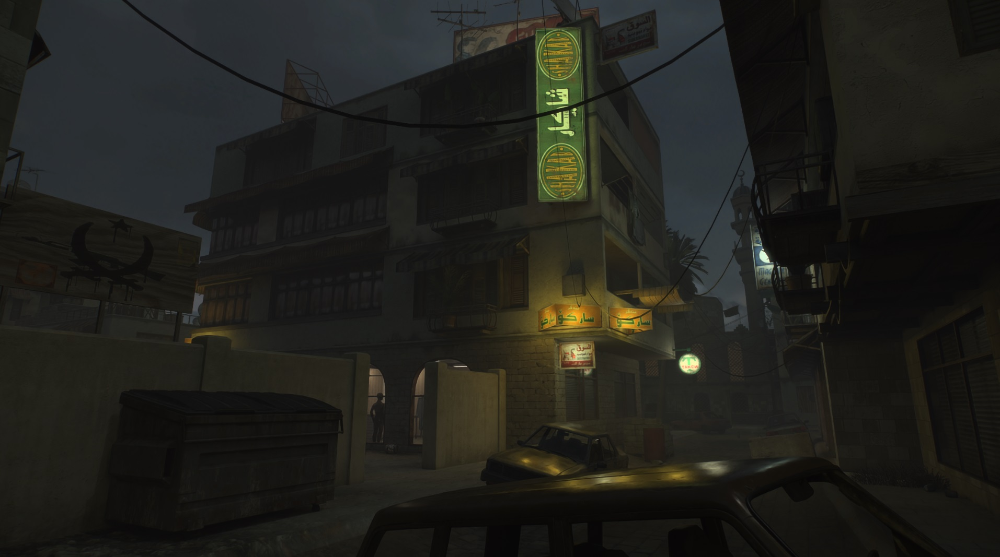
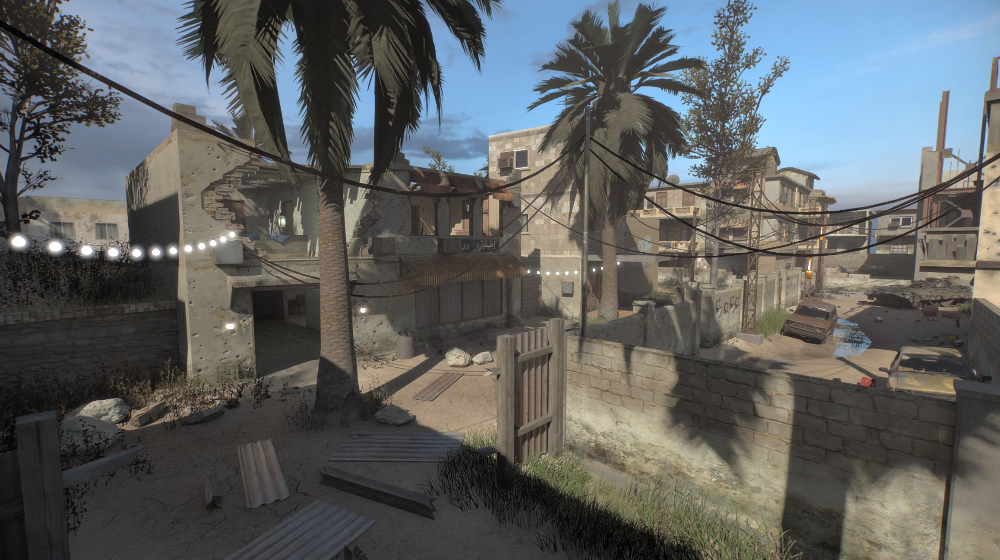

<h1 align="center">iw3xo/rtx - a Call of Duty 4 modification</h3>

 

This client mod brings various modifications and additions to the base game  
and also includes support for nvidia's [RTX Remix](https://github.com/NVIDIAGameWorks/rtx-remix).  

__[ Most noteworthy features of iw3xo ]__  
map exporting -- live link between the game and radiant -- sp map loading in mp --   
collision visualization -- day and night cycle with custom sky shader --     
custom movement options and much more

__[ Remix compatibility ]__   
This client mod does __not__ come with a 'rtx mod' -> that means:  
no custom models, no normal-maps, no fancy pbr materials or lights. 

 

&ensp;
&ensp;
&ensp;
&ensp;
&ensp;

 

### > Features / Guides / In-Depth <
https://xoxor4d.github.io/projects/iw3xo/

# Usage

#### Mandatory but might not feature the latest and greatest:
  1. Download the latest [iw3xo release](https://github.com/xoxor4d/iw3xo-dev/releases) - the `_rtx` build comes with all files required for rtx remix  
  - Extract the contents into your cod4 root directory.  
  - Skip to Step 5 if you are not interested in nightly builds

 

#### Nightly (always up-to-date):

2) [rtx only] Install the latest full rtx-remix release (0.4.1 at this time)   
https://github.com/NVIDIAGameWorks/rtx-remix/tags

 

3) [rtx only] [optional] Install the latest `github action` builds of:  
remix bridge - https://github.com/NVIDIAGameWorks/bridge-remix/actions  
remix runtime - https://github.com/NVIDIAGameWorks/dxvk-remix/actions  

 

4) Download the latest iw3xo (develop branch) `github actions` build:  
  `Build-Release` - https://github.com/xoxor4d/iw3xo-dev/actions  
  - Drop `iw3x.dll` and the contents of the `assets-remix` folder [rtx only] into your cod4 root directory

 

5) Run `run_remix.bat` to start the game with rtx-remix features enabled   
or directly run `iw3xo.exe`
  > `iw3xo.exe` (modified to load `iw3x.dll` instead of `d3d9.dll`)  
  > | -> `iw3x.dll` is a proxy d3d9.dll  
  
 

6) Read the `Dvars / Console Commands` and `Current issues` sections

 
 

# Remix section
🔸 sun, skybox and fog settings can be tweaked by using `map_settings.ini` :: `iw3xo/rtx` folder 🔸
- use console command `/devgui` to open a developer gui -> __RTX__ tab
  - I suggest binding the `/devgui` command to a key, eg: `bind F5 devgui`

 

- A. Commandline Arguments:  

  - `-rtx` :: enable rtx modules (⚠️ required for rtx-remix)
  - `-no_default_sky` :: disable sky spawning (map settings)
  - `-no_sun` :: disable sun spawning (map settings)
  - `-no_fog` :: disable fog (map settings)
  - `-stock_effects` :: render effects using shaders
  - `-old_anti_culling` :: use the old anti culling system
  - `-no_forced_lod` :: do not set `r_forceLod` to `high` by default  
  - `-load_normal_spec` :: enable loading of specular and normal maps (if you need to for some reason)
  - `-thirdperson` :: using the `thirdperson` flag will render the thirdperson playermodel into the firstperson view (for shadow casting. Assign the _Player Model_ material category to hide it from your view (keeps casting shadows) (WIP - also spawns a triangle with a unique texture used as the bounding box origin to hide meshes using textures marked as player model)    

> - commandline example: &ensp;`c:\path\iw3xo.exe -rtx -no_default_sky -stock_effects` 

 

- B. Dvars (I recommend tweaking these via the `/devgui`) :

	🟩 encouraged to be tweaked  
	🟦 can be useful in edge case scenarios  
	🟧 shouldn't be touched 

	#### Culling dvars:
	🟩 `rtx_culling_tweak_mins` :: prevents a bit of culling  
	🟩 `rtx_culling_tweak_maxs` :: prevents a lot of culling  
	🟩 `rtx_culling_tweak_frustum` :: disables frustum culling  
	🟩 `rtx_culling_tweak_smodel` :: disables static model culling  

	#### General dvars:
	🟩 `r_forceLod` :: force all models to a specific LOD  
	🟩 `r_forceLod_second_lowest` :: prevent game from using the lowest LOD (sometimes used to hide the model)  
	🟩 `r_lodScaleRigid` :: adjust static model draw distances (lower values increase draw distance)  
	🟩 `r_showTess` :: draws material info (incl. all image names) of surfaces (geometry / models)  
	🟩 `r_showTessDist` :: adjust draw distance of ^ info text  
	🟩 `r_showCellIndex` :: show portal index info (useful for manual culling overrides via map settings)  
	🟦 `rtx_sky_hacks` :: allows manually declaring textures as sky (maps w. multiple skies)  
	🟦 `rtx_sky_materials` :: materials iw3xo flags as 'sky' materials (logic that replaces the default sky)

	#### Dvars that should only be changed if you know what you are doing:
	🟧 `rtx_warm_smodels` :: build model buffers on map load (enabled by default)  
	🟧 `rtx_hacks` :: replace the skybox with a blue-gray texture  
	🟧 `rtx_extend_smodel_drawing` :: disable static model draw limit (max amount of static models drawn at once)  
	🟧 `rtx_sky_follow_player` :: sky will follow the player (might help with culling in some cases)

	#### Culling dvars when `old_anti_culling` flag is set:
	🟩 `rtx_disable_world_culling` :: tweak overall culling  
    🟩 `rtx_disable_entity_culling` :: tweak culling of script objects (entities)  

 

- C. Console Commands :
	- `mapsettings_update` :: reload map settings
	- `mapsettings_get_defaults` :: prints sun direction, color and intensity in map_settings format based on the stock map settings to the consle

 

## ⚠️ Current Issues
- Swift changes in geometry (eg. teleporting) can crash the game.
  - Decrease geometry drawing by increasing culling or play with `r_lodScaleRigid`

- Remix might try to use your onboard gpu (that is a general CoD issue), so its best to disable it in the bios or within the device manager 

- Some effects will slow down the game (really depends on the effect and the amount)   

 

 

## Questions? 
- join the [rtx-remix showcase](https://discord.gg/j6sh7JD3v9) discord and check out the cod4 thread within the `remix-projects` channel.
- join the [iw3xo](https://discord.gg/t5jRGbj) discord if you have questions related to iw3xo
- sp compatibility mod: [iw3sp-mod-rtx](https://github.com/xoxor4d/iw3sp-mod-rtx) 
- rtx-remix: https://github.com/NVIDIAGameWorks/rtx-remix  

 

___
## Requirements:

1. CoD4 1.7
2. English localization (other languages work when renamed)
> - __root/localization.txt__ &ensp; -> change first line to "english"
> - __root/main/__ &ensp; -> rename "localized_yourlanguage_iw**.iwd" files to "localized_english_iw**.iwd"
> - __root/zone/__ &ensp; -> rename folder "yourlanguage" to "english"

 

___
## Build / Compile

### > How to build / compile the project using Visual Studio
1. Clone the repo! __(zip does not include deps!)__
2. Setup a `COD4_ROOT` environment variable with a path to your cod4 directory (optional)
2. Use __generate-buildfiles.bat__ to build project files with premake
3. Open `(build/iw3xo-dev.sln)` and setup paths for the iw3x project (not needed if Step #2)
> - General &ensp; &ensp; &ensp; output directory path -> `path-to-cod4-root\`
> - Debugging &ensp; command -> `path-to-cod4-root\iw3xo.exe`
> - Debugging &ensp; working directory -> `path-to-cod4-root`
4. Build -> Build Solution or run with debugger

> Optional __(Fastfile sources)__
5. https://github.com/xoxor4d/xcommon_iw3xo (compiled, placed into root/zone/english/)
6. https://github.com/xoxor4d/xcommon_iw3xo_menu (compiled, placed into root/zone/english/)

 

___

 

Optional:  
https://github.com/xoxor4d/iw3xo-radiant

Project Page:  
https://xoxor4d.github.io/projects/iw3xo/

Discord:  
https://discord.gg/t5jRGbj

 

## Credits
- [X Labs](https://github.com/XLabsProject) (especially [Snake](https://github.com/momo5502))
- [The Plutonium Project Team](https://plutonium.pw/) (especially [Rektinator](https://github.com/RektInator))
- [Nukem9 - LinkerMod](https://github.com/Nukem9/LinkerMod)
- [g-truc - glm](https://github.com/g-truc/glm/)
- [ocornut - Dear ImGui](https://github.com/ocornut/imgui)
- [Jelvan1 - cgame proxymod](https://github.com/Jelvan1/cgame_proxymod)
- [Nvidia - rtx-remix](https://github.com/NVIDIAGameWorks/rtx-remix)
- [people of the rtx showcase discord](https://discord.gg/j6sh7JD3v9) (for testing, feedback and ideas)

 

___

## Disclaimer
This software has been created purely for the purposes of academic research. Project maintainers are not responsible or liable for misuse of the software. Use responsibly.
